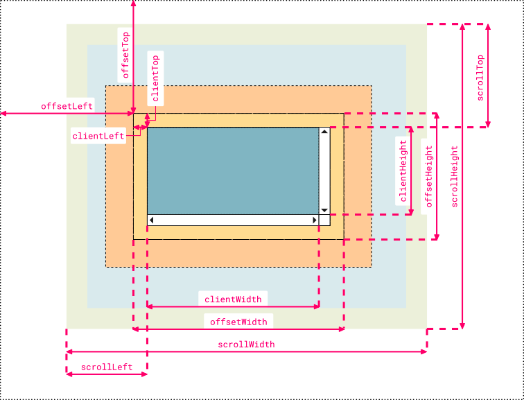
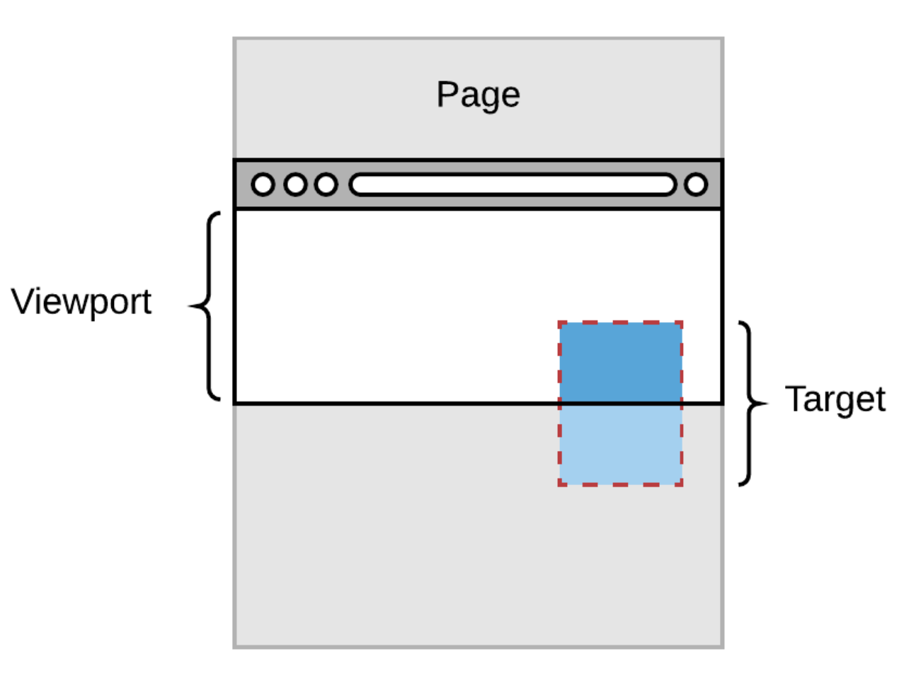
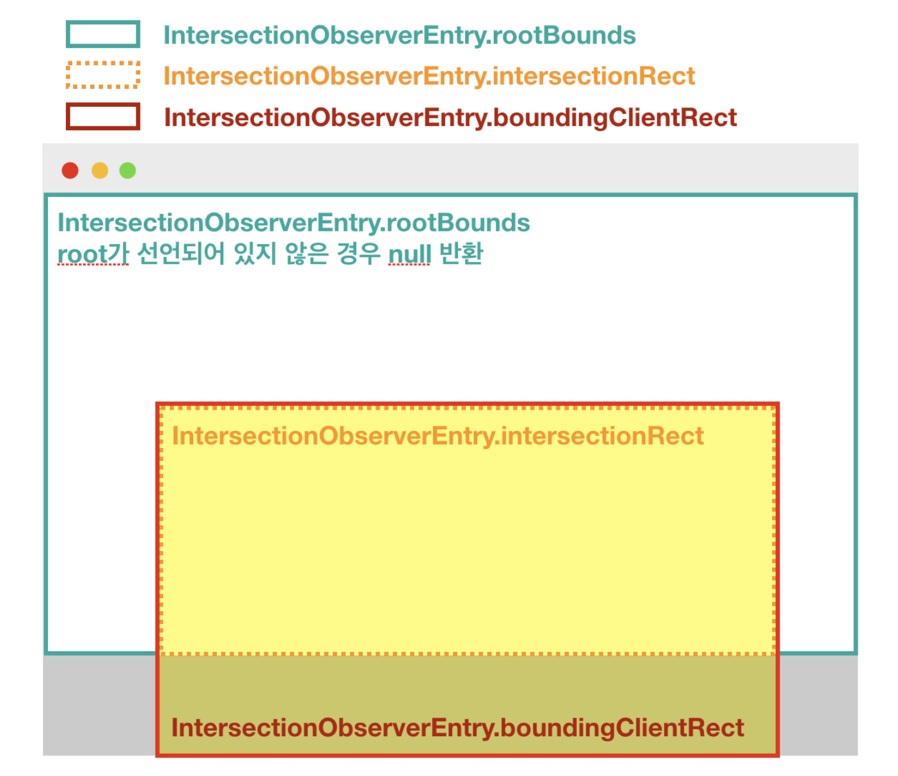
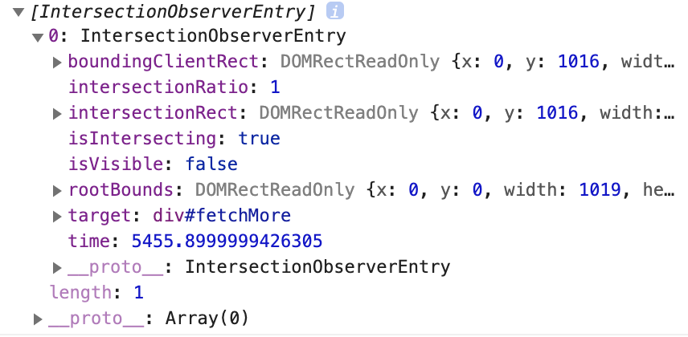

## Infinite Scroll

### 요구사항
1. 최초 20개 목록 불러오기
2. 스크롤을 최하단으로 내리면 -> 'loading' 상태 표시가 나오고 -> 이후 20개 목록을 더 불러온다
3. 로딩 완료시 'loading' 사라짐 -> 가져온 목록이 하단에 추가된다 (무한반복)

- 기하 프로퍼티(단위:픽셀) ([출처](https://stackoverflow.com/questions/21064101/understanding-offsetwidth-clientwidth-scrollwidth-and-height-respectively))
- 
- [요소 사이즈와 스크롤](https://ko.javascript.info/size-and-scroll)
---  
- Q1
- 혼자 풀어본 방법
```javascript
const onScroll = (e) => {
  // do something (hint: e.target.scrollingElement)
  // 풀이하기 위해 생각해본 점 
  // : 스크롤이 마지막에 도달 -> 'loading' 표시 -> 이어서 랜더링 할 부분 가져옴 -> 화면에 보여줌
  const {clientHeight, scrollTop, scrollHeight} = e.target.scrollingElement;
  if (scrollHeight - scrollTop === clientHeight) {
    loadMore();
  }
};
```
- 동영상 풀이
```javascript
const onScroll = (e) => {
  // do something (hint : e.target.scrollingElement)
  const { clientHeight, scrollTop, scrollHeight } = e.target.scrollingElement;
  if (scrollTop + clientHeight === scrollHeight ) {
    fetchMore();
  }
};
```
- 문제에서 의도한대로 비슷하게 풀이
- 아쉬운점 : 스크롤이 움직일때마다 이벤트 발생 -> onScroll가 매번 실행

- Q2
- (debounce / throttle) 개념을 사용하여 반복되는 스크롤 이벤트를 줄인다.
- throttle : 이벤트를 일정한 주기마다 (밀리세컨드) 발생
- debounce : 마지막으로 함수가 호출된 시점에서 특정 시간(밀리세컨드)이 지난 후 마지막 이벤트 한번만 발생
- 목적 : 두 개념 모두 이벤트에 일정 시간 제약을 걸어 과도한 이벤트 발생을 방지하여 웹페이지 성능 향상
```javascript
// 맥락을 잘 모르고 무식하게 한 시도
// 생각 : 같은 이벤트 발생할 것을 시간만 좀 늦추면 되지 않을까?

document.addEventListener("scroll", setTimeout(onScroll, 2000));
// Error...? (실패)
```

```javascript
// 2차 생각 :직접 시간 제한을 거는 함수는 있으니(setTimeout), 
// 받은 이벤트, 지연시간을 그대로 가져와 시간만 지연해서 리턴해보자!

//index.js
import { throttle } from "./util";

const onScroll = (e) => {
  // 달라진 점 없음
}

document.addEventListener("scroll", throttle(onScroll, 2000));

//utils.js
export const throttle = (callback, delay) => {
  // callback : onScroll 구현부 소스가 보인다
  return (e) => {
    // e: Scroll type이 들어간 Event 객체
    setTimeout(callback(e), delay); // 시간지연이 되지 않을까..?
  }
}
// 실패 (시간지연 효과가 없음)
```
- 동영상 풀이
```javascript

//utills.js
export const debounce = (func, delay) => {
  let timeoutId = null;
  // do something
  return (...arg) => {
    clearTimeout(timeoutId);
    timeoutId = setTimeout(func.bind(null, ...arg), delay);
  };
}
```

- 의문점
1. Throttle과 Debounce의 정확한 차이점이 무엇인가?
    - Throttle: 적어도 설정한 지연시간(X 밀리초)에 대해서 정기적인 이벤트 실행을 보장한다
    - Debounce: 아무리 많은 이벤트가 발생해도 모두 무시하고 특정 시간 사이에 어떠한 이벤트도 발생하지 않았을 때, 딱 한번만 마지막 이벤트를 발생시킨다
    - 즉, 설정한 지연시간(X 밀리초)이 지나가기 전에 계속 발생하는 이벤트가 발생하면, 콜백에 반응하는 이벤트는 계속 무시된다
2. (...arg) : 전개 연산자를 사용한 이유?
    - 명시적으로 할당이 안된 모든 인자를 받아오기 위함
3. bind(null, ...arg)는 무엇...?
   - this와 자바스크립트 컨텍스트 개념 [(참고)](https://medium.com/humanscape-tech/%EC%9E%90%EB%B0%94%EC%8A%A4%ED%81%AC%EB%A6%BD%ED%8A%B8-%EC%8B%A4%ED%96%89-%EC%BB%A8%ED%85%8D%EC%8A%A4%ED%8A%B8-1302cf139d25)
     - 실행 컨텍스트 : 인터프리터에 의해 실행되는 자바스크립트 환경
     - 자바스크립트 내부에서 스택으로 실행 컨텍스트를 관리(콜스택)
     - 실행되는 시점에 따라 실행 컨텍스트를 this가 가리킨다
     - 즉, this는 현재 실행되는 코드의 실행 컨텍스트를 가리킨다  
   - 우리는 이 this 값을 그대로 사용할 것이 아니라, 그때 그때 알맞은 객체로 바꿔주고 싶은 것이다!
     - (this binding)
     - 명시적으로 this의 값을 바꿔주는 함수들 : call, apply, bind
     - [call, apply, bind](https://wooooooak.github.io/javascript/2018/12/08/call,apply,bind/)
4. 그렇다면 bind 함수의 첫번째 인자를 null 값으로 넣은 이유?
    - null값 -> this: 전역객체를 가리킨다(기본 바인딩이 적용된다) => 커링 개념?
    - [this 바인딩 우선순위](https://jeonghwan-kim.github.io/2017/10/22/js-context-binding.html)
    
- Q3
- IntersectionObserver API 사용 [MDN](https://developer.mozilla.org/en-US/docs/Web/API/Intersection_Observer_API)
- <해설 코멘트> : IntersectionObserver는 자바스크립트 메인 쓰레드에서 실행되는 Event Listener가 아닌 브라우저에서 별도로 마련한 API이므로 성능 저하의 우려가 적다.
- 화면에 보여지는지 여부를 판단해서, 그 때 감시하고자 하는 요소가 뷰포트에 들어오거나 나갈 때, 들어왔는지 나갔는지 여부를 판단해주는 교차 영역 관리를 해주는 API
- Throttle, Debounce 개념을 사용하여 반복되는 이벤트를 줄인 작업만으로도 충분하긴 하지만, 
- 기왕이면 자바스크립트가 개입되지 않을 수 있는 방법이 있다면 그 방법을 고민해보는 것도 좋다
- MDN 설명이 너무 어려워서..
  - (MDN 정의 중): 상위 요소 또는 최상위 문서의 뷰포트 와 대상 요소의 교차점이란..
  - 
  - [참고 블로그-1](https://velog.io/@katanazero86/Intersection-Observer-API)
  -   
  - [참고 블로그-2](http://blog.hyeyoonjung.com/2019/01/09/intersectionobserver-tutorial/)
  - 기본 구조
  - ```javascript
    const observer = new IntersectionObserver(callback[, options]);
    // callback : 타겟 엘리먼트가 교차되었을 때 실행 할 callback 함수
    // IntersectionObserver에서 반환하는 callback은 IntersectionObserverEntry 객체의 배열을 반환
    // entries : IntersectionObserverEntity 객체의 리스트
    // -> 배열 형태로 리턴
    // -> forEach를 사용하거나, 단일 타겟이면 배열인 점을 고려할 것
    // options : root(defalt: viewport), rootMargin, threshold(교차영역비율)..
    ```
  - Method
    ```javascript
    // 관찰 타겟 등록 후 관찰 시작
    IntersectionObserver.observe(targetElement);
    ```
  - 
- 동영상 풀이
```javascript
const fetchMoreObserver = new IntersectionObserver(([{ isIntersecting }]) => {
  // do something
  if (isIntersecting) {
    fetchMore();
  }
});

fetchMoreObserver.observe(fetchMoreTrigger);

fetchMore();
```
- react 동영상 풀이
```javascript
const FetchMore = ({ loading, setPage }) => {
  const fetchMoreTrigger = useRef(null);
  const fetchMoreObserver = new IntersectionObserver(([{ isIntersecting }]) => {
    // do something
    if (isIntersecting) {
      setPage((value) => value + 1);
    }
  });

  useEffect(() => {
    fetchMoreObserver.observe(fetchMoreTrigger.current);
    return () => {
      fetchMoreObserver.unobserve(fetchMoreTrigger.current);
    };
  }, []);
```
